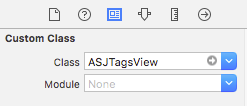
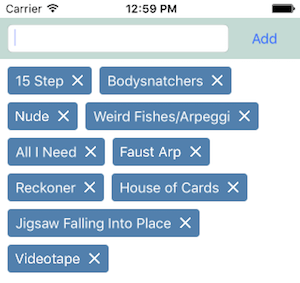

# ASJTagsView

`ASJTagsView` is a UI component that lets you create a view full of tags with a delete icon. These are usually used to show search queries. They can be found in apps like Flipkart and Pinterest.

# Installation

CocoaPods is the recommended way to install this library. Add this command to your `Podfile`:

```
pod 'ASJTagsView'
```

# Usage

Setting up is incredibly easy. Simply drop a `UIScrollView` on your storyboard or xib and change the class to `ASJTagsView`.



There are a number of `IBInspectable` properties that you can use to do some quick customizations.

```
@property (nullable, strong, nonatomic) IBInspectable UIColor *tagColor;
@property (nullable, strong, nonatomic) IBInspectable UIColor *tagTextColor;
@property (nullable, strong, nonatomic) IBInspectable UIImage *crossImage;
@property (assign, nonatomic) IBInspectable CGFloat cornerRadius;
@property (assign, nonatomic) IBInspectable CGFloat tagSpacing;
```

To create one by code, you will need to import `ASJTagsView.h`. To work with the tags view, you have these options"

```
- (void)addTag:(NSString *)tag;
```
Adds a single tag to the tags view.

```
- (void)addTags:(NSArray<NSString *> *)tags;
```
Add an array of `NSString`s to the tag view.

```
- (void)deleteTag:(NSString *)tag;
```
Delete all similarly named tags according to the string provided.

```
- (void)deleteTagAtIndex:(NSInteger)idx;
```
Delete tag at the specified array index.

```
- (void)deleteAllTags;
```
Empty the tags view.

```
- (void)reloadTagsView;
```
Manual reload. Note that whenever you add or remove tags, the view will reload itself.

There are two blocks that you can handle to get certain events:

```
- (void)setTapBlock:(TagBlock _Nullable)tapBlock;
```
Called when a tag is tapped. Inside the block, you will receive the tag string and the index at which it is present in the view.

```
- (void)setDeleteBlock:(TagBlock _Nullable)deleteBlock;
```
Called when a cross (delete button) is tapped. Inside the block, you will receive the tag string and the index at which it is present in the view.



# Credits

- Cross icon taken from Google [Material Icons](https://design.google.com/icons/#ic_clear).

# To-do

- ~~Add horizontal and vertical support~~
- ~~Add customisation options for tag view~~
- Add support for adding custom view
- Add option to disable cross
- Add option to show tags of random colors

# License

`ASJTagsView` is available under the MIT license. See the LICENSE file for more info.
